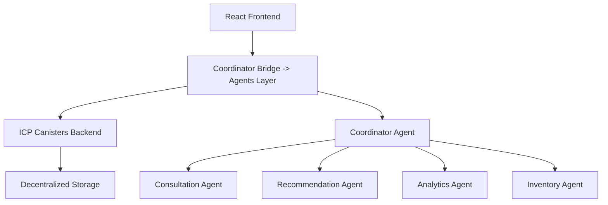

# Aromance - AI-Powered Perfume Marketplace

 
[](https://opensource.org/licenses/MIT)
[](https://internetcomputer.org/)
[](https://fetch.ai/)

An intelligent perfume marketplace leveraging **Fetch.ai uAgents** and **Internet Computer Protocol** for personalized fragrance recommendations and decentralized identity protection.

🌟 **Built for NextGen Agents Hackathon 2025** - [View on DoraHacks](https://dorahacks.io/buidl/31403)

## 🎯 Introduction

Aromance addresses three critical challenges in the Indonesian perfume industry:

- **92.9%** of consumers struggle to choose fragrances that match their personality
- **85.7%** experience fake reviews and misleading product information  
- **71.4%** are concerned about personal data privacy and breaches

Our solution combines AI-powered personality analysis with blockchain technology to create a secure, personalized perfume shopping experience where users maintain complete control over their personal data through decentralized identity systems.

## 🏗️ Architecture

The platform uses a sophisticated multi-layer architecture integrating three cutting-edge technologies:



**🎨 Frontend Layer**: React 19 with Vite for modern, responsive UI/UX  
**🤖 AI Agent Layer**: Five specialized Fetch.ai agents handling different business logic  
**⚙️ Backend Layer**: Rust canisters on Internet Computer Protocol for scalability  
**💾 Data Layer**: Decentralized storage with user-controlled access permissions  

### Agent Communication Flow
Our coordinator agent implements a sophisticated chat protocol using Claude API for natural language processing and inter-agent message extraction, enabling seamless communication between all specialized agents.

## 🛠️ Technology Stack

| **Layer** | **Technology** | **Version** | **Purpose** |
|-----------|----------------|-------------|-------------|
| **Frontend** | React | 19.1.1 | User Interface |
| | Vite | 4.3.9 | Build Tool |
| | TypeScript | 5.1.3 | Type Safety |
| | SCSS | 1.63.6 | Styling |
| **Backend** | Rust | Edition 2021 | ICP Canisters |
| | Internet Computer | Protocol | Blockchain Backend |
| | Candid | Interface | API Definition |
| **AI Agents** | Python | 3.12.3 | Agent Runtime |
| | Fetch.ai uAgents | Framework | Multi-Agent System |
| | CosmPy | - | Blockchain Integration |
| | httpx | 0.28.1 | Async HTTP Client for agent communication |
| **Development** | Node.js | 20.19.4 | JavaScript Runtime |
| | DFX | 0.24.3 | ICP SDK |
| | Ubuntu | 24.04.2 LTS | Development OS |

## 🚀 Build and Deployment Instructions

### Prerequisites
- **OS**: Ubuntu 22.04+ (recommended 24.04.2 LTS)
- **RAM**: Minimum 8GB 
- **Storage**: 20GB free space
- **Network**: Stable internet connection
- **Wallet**: [Plug Wallet](https://plugwallet.ooo/) extension for testing frontend functionality

### 🔧 Automated Installation

1. **Clone the repository**
```bash
git clone https://github.com/WillyGrahamm/aromance
cd aromance
```

2. **Run the automated installer**
```bash
chmod +x install.sh
./install.sh
```

**What the installer does:**
- Updates system packages and installs dependencies
- Installs Node.js v20.x, Rust toolchain, Python 3.12
- Sets up DFX 0.24.3 with wasm32 target
- Creates Python virtual environment with uAgents
- Installs all npm and cargo dependencies
- Builds the complete Rust workspace

> **⚠️ Python Installation Note**: If you encounter "externally managed" Python environment error, you may need to install packages manually:
> ```bash
> pip install --break-system-packages uagents cosmpy requests asyncio httpx
> ```

### 🏃‍♂️ Development Workflow

#### 1. **Start ICP Local Network**
```bash
# Run from project root
dfx start --background --clean
```

#### 2. **Deploy Backend Canisters**
```bash
# Run from project root
dfx deploy aromance_backend
```

#### 3. **Start AI Agents**
```bash
source fetchai_env/bin/activate
cd agents
python run_all_agent.py  # Main coordinator
# Or run individual agents:
python consultation/consultation_agent.py
python recommendation/recommendation_agent.py
```

#### 4. **Launch Frontend Application**
```bash
# Return to project root first
cd .. # (if in agents directory)
cd src/aromance_frontend
# Sometimes requires reinstallation despite install.sh
npm ci
npm install react react-dom  # May need manual installation
npm start
```

### 🌐 Access Points
- **Frontend Application**: http://localhost:3000
- **ICP Dashboard**: http://localhost:4943
- **Backend Canister**: http://localhost:4943/?canisterId=bkyz2-fmaaa-aaaaa-qaaaq-cai

### 🧪 Testing Your Installation

```bash
# Test AI agents health (use 0.0.0.0 for testing)
curl http://127.0.0.1:8000/health  # Coordinator Agent
curl http://127.0.0.1:8002/health  # Consultation Agent
curl http://127.0.0.1:8003/health  # Recommendation Agent
curl http://127.0.0.1:8004/health  # Analytics Agent
curl http://127.0.0.1:8005/health  # Inventory Agent

# Test ICP canister
dfx canister call aromance_backend greet '("Hello Aromance")'
```

## 🔗 Internet Computer Protocol Features

### Advanced ICP Features Implemented

**🌐 HTTP Outcalls**: Real-time integration with Fetch.ai agents for seamless AI-blockchain communication  
**⏰ Timers**: Automated treasury management, analytics processing, and reward distribution  
**🔄 Inter-Canister Communication**: Modular architecture enabling scalable microservices  
**💾 Stable Memory**: Persistent storage across canister upgrades with zero data loss  
**🛡️ Certified Variables**: Tamper-proof data integrity for critical user information  

### Plug Wallet Integration
**🔐 Decentralized Identity Management**: Users connect their Plug Wallet address as their primary identifier, linking wallet addresses to decentralized identities (DID) for secure, user-controlled data management and monetization rights.

### Core Canister Functions

| **Category** | **Function** | **Purpose** |
|--------------|--------------|-------------|
| **User Management** | `create_user_profile` | User registration with wallet-linked DID |
| | `get_user_profile` | Profile data retrieval |
| **Decentralized Identity** | `create_decentralized_identity` | Fragrance personality creation |
| | `update_user_data_permissions` | Privacy control management |
| **Product Management** | `add_product`, `search_products_advanced` | Product catalog management |
| | `get_halal_products` | Indonesian market compliance |
| **AI Recommendations** | `generate_ai_recommendations` | Personalized product matching |
| **Verification System** | `stake_for_verification` | Proof-of-stake user verification |
| **Analytics** | `generate_analytics_data`, `get_seller_analytics` | Business intelligence |

## 🤖 Fetch.ai Features and Agents

### Multi-Agent System Architecture

Our platform implements five specialized autonomous agents, all categorized under **Innovation Lab**:

| **Agent Name** | **Address** | **Primary Function** |
|----------------|-------------|---------------------|
| **Coordinator Agent** | `agent1q0c3gfhhufskvm0tfssj05y6exkfwckea9400sr2luj6l98da8n8ykxssyd` | Main orchestrator managing all agent communications |
| **Coordinator Bridge** | ` agent1q059hp8a78xnuwg6673kantmgsu0m5yvcr34483l5nsvfyfqk778wnwe65z` | Frontend-Backend Bridge |
| **Consultation Agent** | `agent1qte4mymlf2upe79qlrjreemhcmarjndp8mh756wtruql4m45euj9wz4auz2` | Personality analysis and preference extraction |
| **Recommendation Agent** | `agent1qgkurunk708n00gdawx8u0a4qcwmtzzul09lyd372e7c5whjftrsc2xn85s` | AI-powered product matching algorithm |
| **Analytics Agent** | `agent1q2g2zkhqujwu6v52jlstxyeuylu8p5tvc9fp27uwunhacrj6n90tcg4nwm3` | User behavior tracking and market insights |
| **Inventory Agent** | `agent1qvf6kv530le2glvp239rvjy6hyu3hz8jchp6y29yp2sg2nm0rwk4x9nttnd` | Stock monitoring and restock predictions |

### Advanced Agent Features

**🔗 Inter-Agent Communication**: Custom protocol with message passing and Claude API integration  
**🔍 Agent Discovery**: Dynamic service registration and discovery mechanism  
**💰 Blockchain Integration**: CosmPy-powered micropayments between agents  
**📡 Event-Driven Architecture**: Pub/sub pattern for real-time updates  
**🛠️ Fault-Tolerant Communication**: Retry mechanisms and graceful degradation  

### Agent Communication Protocol

Our coordinator agent implements a sophisticated chat protocol that:
- Extracts and routes messages between specialized agents
- Maintains conversation context across agent interactions
- Provides seamless user experience through intelligent orchestration

## 🔥 Complex Features Implemented

**🧠 Advanced AI Pipeline**: Custom personality analysis combining fragrance notes with psychological profiling  
**🔐 Decentralized Identity Management**: Complete user data ownership with monetization rights  
**💎 Economic Incentive System**: Proof-of-stake verification with tiered rewards (6-9% annual returns)  
**🕌 Halal Certification**: Specialized support for Indonesian Muslim market (85% population)  
**📊 Real-time Analytics**: Multi-dimensional user behavior analysis with predictive insights  

### Verification Stake Requirements
- **Basic Reviewer**: 300k IDR (6% annual return)
- **Premium Reviewer**: 950k IDR (7.5% annual return) 
- **Elite Reviewer**: 1.9M IDR (9% annual return)
- **Basic Seller**: 500k IDR (6% annual return)
- **Premium Seller**: 1.5M IDR (7.5% annual return)
- **Elite Seller**: 3M IDR (9% annual return)

## 💪 Challenges Faced During Hackathon

### 🌐 Agent Network Connectivity
**Challenge**: Intermittent connection issues between distributed agents  
**Solution**: Implemented local communication fallback mechanisms and offline development capabilities

### 🧠 ICP Memory Optimization
**Challenge**: Initial memory usage exceeded canister limits during complex operations  
**Solution**: Complete architecture refactoring using custom serialization with stable memory management

### ⚡ Real-time Synchronization  
**Challenge**: Maintaining consistency between AI agent decisions and ICP blockchain state  
**Solution**: Event-driven architecture with HTTP outcalls for seamless integration

### 🐛 Critical Schema Bug
**Challenge**: UserProfile schema causing subtyping errors  
**Solution**: 
```rust
// Fixed: data_monetization_consent is now REQUIRED
pub struct UserProfile {
    data_monetization_consent: bool, // Previously optional, now required
    // ... other fields
}
```

### 🐍 Python Environment Management
**Challenge**: Modern Python distributions being "externally managed"  
**Solution**: Enhanced installer with `--break-system-packages` fallback and clear documentation

## 🚀 Future Plans

### **Beyond Fragrance: The Future of Personal Care**

Aromance's vision extends beyond perfume into Indonesia's broader IDR 145 trillion **beauty and personal care market.** Our AI-powered personalization engine will expand to body wash, hair oils, skincare, and soaps—essential daily needs that deserve the same cultural understanding and privacy protection we bring to fragrance.

Just as we understand that jasmine and sandalwood matter in Indonesian perfume culture, we'll bring this same localized intelligence to personal care products that work in our tropical climate and align with our cultural values.

### 📅 Phase 1 (Q3 2025) - Production Launch
- **🌍 ICP Mainnet Deployment**: Full production release
- **📱 Mobile Applications**: iOS and Android native apps
- **🤖 Enhanced ML Models**: Improved recommendation accuracy
- **👥 Social Features**: Community building and user interactions

### 📅 Phase 2 (Q4 2025) - Regional Expansion  
- **🌏 Multi-language Support**: Indonesian, English, Arabic
- **🖼️ NFT Integration**: Unique fragrance identity tokens
- **🤝 Brand Partnerships**: Direct collaborations with perfume houses

### 📅 Phase 3 (2026) - Ecosystem Growth
- **⛓️ Cross-chain Support**: Ethereum, Solana integration
- **🛒 Agent Marketplace**: Agents-as-a-Service platform
- **🏛️ Decentralized Governance**: Community-driven platform decisions
- **🔬 Open Source Research**: Olfactory psychology contributions

## 🌟 Unique Value Proposition

Aromance is the **first AI-powered perfume marketplace** that combines:

- **🧬 Specialized Fragrance AI**: Trained on fragrance notes and personality correlations
- **🔐 Decentralized Identity**: Complete user data ownership and monetization rights  
- **💰 Economic Incentives**: Proof-of-stake verification with sustainable rewards
- **🕌 Cultural Sensitivity**: Halal certification for Indonesian Muslim market
- **🤖 Multi-Agent Intelligence**: Autonomous agents handling complex business logic

## 📊 Project Structure

```
aromance/
├── 🏗️ .dfx/                     # ICP local deployment artifacts
├── 🔧 .env                      # Environment configuration
├── 🤖 agents/                   # Fetch.ai AI Agents
│   ├── 📋 coordinator.py        # Main orchestrator (3.8KB)
│   ├── 💭 consultation/         # Personality analysis agent
│   ├── 🎯 recommendation/       # Product matching engine
│   ├── 📊 analytics/           # User behavior analysis
│   ├── 📦 inventory/           # Stock management
│   ├── 🗃️ coordinator_agent       # Root Of All Agent & Chat protocol
│   ├── ⚙️ coordinator_bridge      # Agents Layer
│   └── 🧪 run_all_agent.py        # Testing all agent utilities (809B)
├── 📁 src/
│   ├── 🦀 aromance_backend/    # Rust ICP canister
│   │   ├── 📄 src/lib.rs       # Backend implementation
│   │   └── 🔗 aromance_backend.did # Candid interface
│   └── ⚛️ aromance_frontend/   # React application
│       ├── 🎨 src/App.jsx      # Main application (9.4KB)
│       └── 📦 package.json     # Frontend dependencies
├── 🐍 fetchai_env/             # Python virtual environment
├── ⚡ install.sh               # Automated installer
├── 🦀 Cargo.toml              # Rust workspace configuration
├── 🔧 dfx.json                # ICP configuration
└── 📦 package.json            # Root dependencies
```

## 📄 License

This project is licensed under the MIT License – see the [license](https://aromance.gitbook.io/aromance-docs/mit-license) in our documentation.

## 📞 Contact & Links

- **🌐 Landing Page**: https://aromance-e56c8.web.app/
- **🗂️ Pitch Deck**: https://aromance-e56c8.web.app/PD_Aromance.pdf
- **🔴 Demo Video** : https://youtu.be/F5PTAI8XjJs
- **📋 Project Proposal/Full Documentation**: https://aromance-e56c8.web.app/Aromance-Resources.pdf
- **🏆 DoraHacks BUIDL**: https://dorahacks.io/buidl/31403
- **📧 Email**: willygraham2009@gmail.com

---

**Built with ❤️ for NextGen Agents Hackathon 2025**  
*Leveraging Fetch.ai Innovation Lab and ICP Hubs Network*
